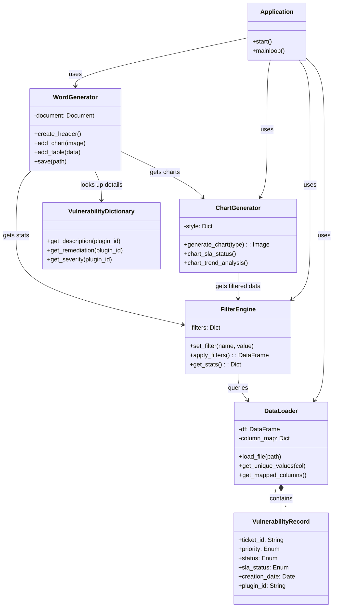
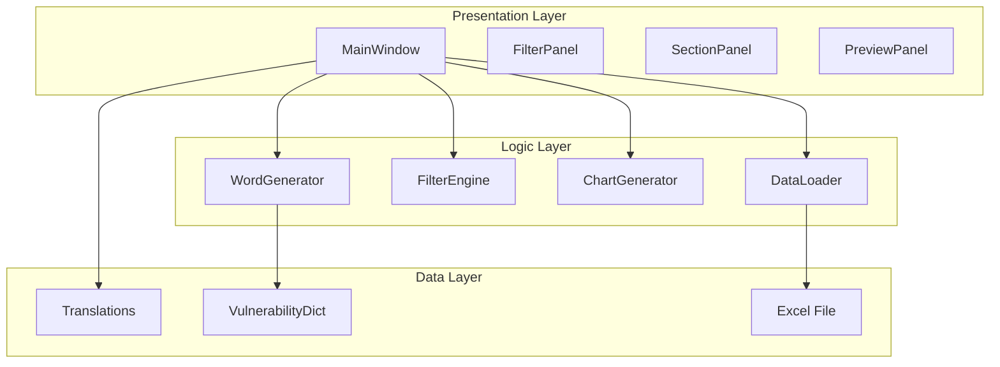

# ReportIQ - Technical Documentation

## 1. System Overview
**ReportIQ** is a desktop application designed to automate the processing, analysis, and reporting of cybersecurity vulnerability data. It follows a modular architecture separating the GUI, data processing logic, and report generation.

---

## 2. Use Case View

### 2.1 Use Case Diagram
```mermaid
usecaseDiagram
    actor User as "Security Analyst"
    
    package "ReportIQ System" {
        usecase "Load Excel Data" as UC1
        usecase "Map Columns" as UC2
        usecase "Filter Vulnerabilities" as UC3
        usecase "Select Report Sections" as UC4
        usecase "Generate Report" as UC5
        usecase "Switch Language" as UC6
        usecase "View Data Preview" as UC7
    }

    User --> UC1
    User --> UC3
    User --> UC4
    User --> UC5
    User --> UC6
    
    UC1 ..> UC2 : <<include>>
    UC3 ..> UC7 : <<include>>
```

### 2.2 Use Case Descriptions

| Use Case | Description |
| :--- | :--- |
| **UC1: Load Excel Data** | The user selects an `.xlsx` file containing vulnerability tickets. The system validates the file and parses the content. |
| **UC2: Map Columns** | The system automatically identifies columns (e.g., TICKETID, PRIORITY). If automatic mapping is uncertain, it defaults to best guesses (logic implemented in `DataLoader`). |
| **UC3: Filter Vulnerabilities** | The user applies filters such as SLA Status (In/Out), Priority (High/Critical), Tool Source, Year, or Department. The "Filter Engine" processes these constraints. |
| **UC4: Select Report Sections** | The user chooses which analytical charts (e.g., Trend Analysis, Top 10) to include in the final Word document. |
| **UC5: Generate Report** | The system aggregates the filtered data, generates selected charts using `matplotlib`, creates a Word document via `python-docx`, and saves it to the user's disk. |
| **UC6: Switch Language** | The user toggles between Turkish (TR) and English (EN). The UI and the generated report content update immediately. |

---

## 3. Domain Model

The Domain Model represents the conceptual entities and their relationships within the ReportIQ ecosystem.

### 3.1 Domain Class Diagram


### 3.2 Entity Descriptions

*   **DataLoader**: Responsible for reading the raw Excel file, handling date parsing, and mapping technical Excel column names (e.g., `SLA_Value`, `Day_of_CREATIONDATE`) to internal standard names.
*   **FilterEngine**: Acts as the query processor. It takes the raw DataFrame from `DataLoader` and applies active user filters to produce a "Filtered DataFrame" used for analysis.
*   **VulnerabilityRecord**: Represents a single row in the Excel file, corresponding to one security ticket.
*   **ChartGenerator**: A specialized rendering engine that takes filtered data and produces visual artifacts (`Bitmaps`/`BytesIO`) for 11 different analysis types using `matplotlib` and `seaborn`.
*   **WordGenerator**: The reporting engine that assembles the narrative, tables, and images into a structured `.docx` file.
*   **VulnerabilityDictionary**: A static data source (Knowledge Base) containing description and remediation texts for known Plugin IDs (e.g., "SSL Certificate Expiry").

---

## 4. System Architecture

The application defines a clear separation of concerns, similar to Model-View-Controller (MVC).

### 4.1 Component Diagram


*   **Presentation Layer (GUI)**: Built with `customtkinter`. Handles user events and state. Validates inputs before passing them to the Core.
*   **Logic Layer (Core)**: Pure Python classes (`pandas`, `matplotlib`, `python-docx`) that perform the heavy lifting. Independent of the GUI code.
*   **Data Layer**: Static assets and external files.

## 5. Technology Stack
*   **Language**: Python 3.9+
*   **UI Framework**: CustomTkinter
*   **Data Processing**: Pandas, OpenPyXL
*   **Visualization**: Matplotlib, Seaborn
*   **Reporting**: Python-Docx
